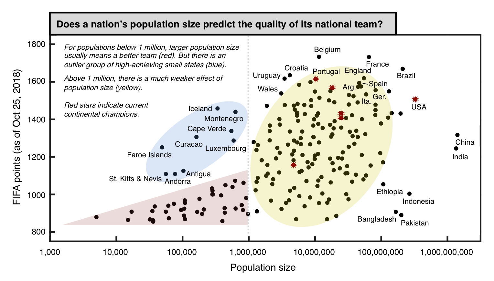

README
================

Inspiration
-----------

<https://old.reddit.com/r/soccer/comments/9xvggj/oc_does_a_nations_population_size_predict_the/>

General sources
---------------

-   ELO: eloratings.net
-   Population 2017: <https://population.un.org/wpp/>

Sources for missing Population data
-----------------------------------

-   <https://en.wikipedia.org/wiki/Collectivity_of_Saint_Martin>
-   <https://en.wikipedia.org/wiki/Demography_of_England>
-   <https://en.wikipedia.org/wiki/Demography_of_Northern_Ireland>
-   <https://en.wikipedia.org/wiki/Chagos_Archipelago>
-   <https://en.wikipedia.org/wiki/Demography_of_Wales>
-   <https://en.wikipedia.org/wiki/Zanzibar>
-   <https://en.wikipedia.org/wiki/Bonaire>
-   <https://de.wikipedia.org/wiki/Saint-Barth%C3%A9lemy_(Insel)>
