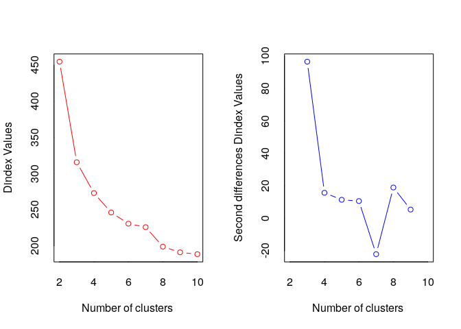

README
================

Inspiration
-----------

[This post](https://old.reddit.com/r/soccer/comments/9xvggj/oc_does_a_nations_population_size_predict_the/ "Reddit Link") on reddit was used as inspiration for this body of work (see figure below). The author tries to show the relationship between a nations population and the performance of its soccer team. I like the idea (and the graphic) but see some errors that I wanted to correct:

1.  The FIFA points ranking is a bad measure of a soccer teams actual strength [(Source)](http://lasek.rexamine.com/football_rankings.pdf "Source"). Measures like Elo-rating should be used **and are used** by more sophisticated writers (e.g. 538).
2.  An average of soccer performance should be used (e.g. Average ELO rating of the last 10 years), not a point measurement in time.
3.  The line at 1 million strikes and the coloured bubbles strike me as 100% arbitrary. If anything, a simple clustering algorithm should be used to determine appropriate clusters (e.g. k-means).


Results
-------

### Using recent Elo Ratings

First, let us have a look at this graph if we use the World Soccer Elo Rating of December 2017 (pre WorldCup):

    ## # A tibble: 5 x 3
    ##   Country            Code  `Social Progress Index`
    ##   <chr>              <chr>                   <dbl>
    ## 1 Channel Islands    CHI                        NA
    ## 2 Kosovo             KSV                        NA
    ## 3 North Cyprus       NCY                        NA
    ## 4 Somaliland         SML                        NA
    ## 5 West Bank and Gaza WBG                        NA


    ## 
    ##  Kendall's rank correlation tau
    ## 
    ## data:  eloPop$elo17 and eloPop$PopTotal
    ## z = 9.2737, p-value < 0.00000000000000022
    ## alternative hypothesis: true tau is not equal to 0
    ## sample estimates:
    ##       tau 
    ## 0.4118651

We see a much clearer positive correlation between Population and Performance, althoug it fizzes out a both ends of population.

What happens when we insert the countries names  No we can easily recognize the outliers

-   Better than expected: Iceland, Portugal, Germany, Brazil
-   Worse than expected: Sri Lanka, Bangladesh, India

Iceland and Portugal are the best examples: two small countries that have performed suprisingly well in recent years.

### Using average Elo Ratings

The two positive outliers show, that the graphic is biased on nations that have performed well only in recent years. So let us now look at the Average Elo-Rating:


    ## 
    ##  Kendall's rank correlation tau
    ## 
    ## data:  eloPop$avgElo and eloPop$PopTotal
    ## z = 9.3565, p-value < 0.00000000000000022
    ## alternative hypothesis: true tau is not equal to 0
    ## sample estimates:
    ##       tau 
    ## 0.4154963

The correlation stays the same, but we see different outliers:

-   Better than expected: Urugay, Croatia, Scotland
-   Worse than expected:

This also makes sense, as Urugay and Croatia are historically better teams than Iceland & Portugal.

Using more Information
----------------------

### Life Expectancy

What happens when we add more Information to the simple plot


    ## 
    ##  Kendall's rank correlation tau
    ## 
    ## data:  eloPopLife$elo17 and eloPopLife$LEx
    ## z = 4.5485, p-value = 0.000005404
    ## alternative hypothesis: true tau is not equal to 0
    ## sample estimates:
    ##       tau 
    ## 0.2170236

    ## 
    ##  Kendall's rank correlation tau
    ## 
    ## data:  eloPopLife$PopTotal and eloPopLife$LEx
    ## z = -1.9324, p-value = 0.05331
    ## alternative hypothesis: true tau is not equal to 0
    ## sample estimates:
    ##         tau 
    ## -0.09216005

We see that it helps somewhat. Life Expectancy is not correlated with Population but **is** positively correlated with Elo-Rating.

-   Nations above the smoothing line seem to have a higher life expectancy (notable exception: Nigeria, Cameroon)
-   Nations below the line seem to have a lower life expectancy (notable exceptions: Taiwan, Hongkong, Singapore).

### Social Progress Index

We see the same pattern when we use a different measure for the quality of life in a nation:


    ## 
    ##  Kendall's rank correlation tau
    ## 
    ## data:  eloPopSPI$elo17 and eloPopSPI$SocialProgressIndex
    ## z = 7.1268, p-value = 0.000000000001027
    ## alternative hypothesis: true tau is not equal to 0
    ## sample estimates:
    ##       tau 
    ## 0.3981661

    ## 
    ##  Kendall's rank correlation tau
    ## 
    ## data:  eloPopSPI$PopTotal and eloPopSPI$SocialProgressIndex
    ## z = -1.5566, p-value = 0.1196
    ## alternative hypothesis: true tau is not equal to 0
    ## sample estimates:
    ##         tau 
    ## -0.08692366

Finding clusters in the data
----------------------------

Let us see now what how we can best group the Population and Elo data.

``` r
library(clValid)
library(factoextra)
library(NbClust)
library(tidyverse)
clusDat <- eloPop[,c("PopTotal", "avgElo")]
clusDat <- eloPop[,c("elo17", "highElo", "avgElo", "lowElo", "PopTotal", "elo07")]
rownames(clusDat) <- eloPop$Name
clusDat$PopTotal <- log(clusDat$PopTotal)

intern <- clValid(clusDat, nClust = 2:6, 
              clMethods = c("hierarchical","kmeans","pam", "sota", "fanny"),
              validation = c("internal"),
              metric = "euclidean")
# Summary
summary(intern)
```

    ## 
    ## Clustering Methods:
    ##  hierarchical kmeans pam sota fanny 
    ## 
    ## Cluster sizes:
    ##  2 3 4 5 6 
    ## 
    ## Validation Measures:
    ##                                  2       3       4       5       6
    ##                                                                   
    ## hierarchical Connectivity   9.3504 21.7032 29.6222 35.7794 38.6083
    ##              Dunn           0.0767  0.0503  0.0705  0.0879  0.0879
    ##              Silhouette     0.5459  0.4756  0.4430  0.3926  0.3455
    ## kmeans       Connectivity  15.5556 24.6710 34.9813 45.1738 43.4242
    ##              Dunn           0.0511  0.0402  0.0578  0.0620  0.0803
    ##              Silhouette     0.5253  0.5014  0.4405  0.4052  0.3739
    ## pam          Connectivity  28.7067 24.0575 51.2437 58.7179 54.8393
    ##              Dunn           0.0322  0.0472  0.0326  0.0493  0.0456
    ##              Silhouette     0.4943  0.4991  0.3939  0.3876  0.3669
    ## sota         Connectivity  25.8639 35.1778 46.7095 60.5175 71.5250
    ##              Dunn           0.0381  0.0381  0.0557  0.0686  0.0686
    ##              Silhouette     0.5143  0.3909  0.4208  0.3684  0.3118
    ## fanny        Connectivity  11.3810 23.8175 40.0619 80.9036 63.0750
    ##              Dunn           0.0483  0.0449  0.0660  0.0478  0.0572
    ##              Silhouette     0.4850  0.4914  0.4009  0.3234  0.3264
    ## 
    ## Optimal Scores:
    ## 
    ##              Score  Method       Clusters
    ## Connectivity 9.3504 hierarchical 2       
    ## Dunn         0.0879 hierarchical 5       
    ## Silhouette   0.5459 hierarchical 2

``` r
set.seed(123)
res.nbclust <- NbClust(clusDat, distance = "euclidean",
                  min.nc = 2, max.nc = 10, 
                  method = "complete", index ="all") 
```


    ## *** : The Hubert index is a graphical method of determining the number of clusters.
    ##                 In the plot of Hubert index, we seek a significant knee that corresponds to a 
    ##                 significant increase of the value of the measure i.e the significant peak in Hubert
    ##                 index second differences plot. 
    ## 



    ## *** : The D index is a graphical method of determining the number of clusters. 
    ##                 In the plot of D index, we seek a significant knee (the significant peak in Dindex
    ##                 second differences plot) that corresponds to a significant increase of the value of
    ##                 the measure. 
    ##  
    ## ******************************************************************* 
    ## * Among all indices:                                                
    ## * 3 proposed 2 as the best number of clusters 
    ## * 13 proposed 3 as the best number of clusters 
    ## * 3 proposed 6 as the best number of clusters 
    ## * 1 proposed 8 as the best number of clusters 
    ## * 1 proposed 9 as the best number of clusters 
    ## * 2 proposed 10 as the best number of clusters 
    ## 
    ##                    ***** Conclusion *****                            
    ##  
    ## * According to the majority rule, the best number of clusters is  3 
    ##  
    ##  
    ## *******************************************************************

``` r
factoextra::fviz_nbclust(res.nbclust) + theme_minimal()
```

    ## Among all indices: 
    ## ===================
    ## * 2 proposed  0 as the best number of clusters
    ## * 1 proposed  1 as the best number of clusters
    ## * 3 proposed  2 as the best number of clusters
    ## * 13 proposed  3 as the best number of clusters
    ## * 3 proposed  6 as the best number of clusters
    ## * 1 proposed  8 as the best number of clusters
    ## * 1 proposed  9 as the best number of clusters
    ## * 2 proposed  10 as the best number of clusters
    ## 
    ## Conclusion
    ## =========================
    ## * According to the majority rule, the best number of clusters is  3 .


``` r
# Try out the hierarchical clustering with 2 groups
res <- hcut(clusDat, k = 3, stand = FALSE)


completeDat <- mutate(eloPop, cluster = res$cluster)
ggplot(completeDat, aes(PopTotal, avgElo, label = Name , colour = factor(cluster))) + geom_text(size=1.5) + theme_tufte(ticks = F) + 
  theme(axis.title = element_blank()) + scale_x_continuous(trans = "log10", breaks = 100 * 
                                                             (10^(1:7)), labels = comma)+scale_color_discrete(guide=FALSE)
```


``` r
ggplot(completeDat, aes(PopTotal, elo17, label = Name , colour = factor(cluster))) + geom_text(size=1.5) + theme_tufte(ticks = F) + 
  theme(axis.title = element_blank()) + scale_x_continuous(trans = "log10", breaks = 100 * 
                                                             (10^(1:7)), labels = comma)+
  scale_color_discrete(guide=FALSE)
```


``` r
#fviz_cluster(res, stand = FALSE, repel = FALSE)
#fviz_silhouette(res)
#fviz_dend(res, rect = TRUE)
```

Data Sources
------------

-   ELO: <http://www.eloratings.net>
-   Population Data 2017: <https://population.un.org/wpp/>

### Sources for missing Population data

-   <https://en.wikipedia.org/wiki/Collectivity_of_Saint_Martin>
-   <https://en.wikipedia.org/wiki/Demography_of_England>
-   <https://en.wikipedia.org/wiki/Demography_of_Northern_Ireland>
-   <https://en.wikipedia.org/wiki/Chagos_Archipelago>
-   <https://en.wikipedia.org/wiki/Demography_of_Wales>
-   <https://en.wikipedia.org/wiki/Zanzibar>
-   <https://en.wikipedia.org/wiki/Bonaire>
-   <https://de.wikipedia.org/wiki/Saint-Barth%C3%A9lemy_(Insel)>
