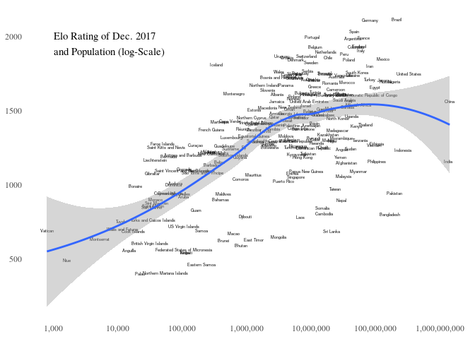
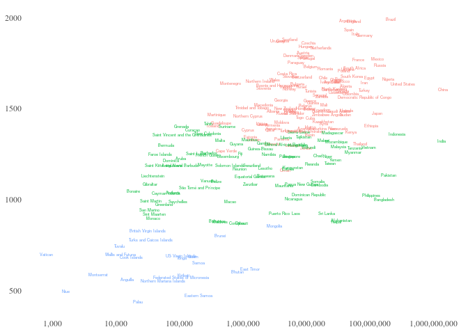

README
================

Inspiration
-----------

[This post](https://old.reddit.com/r/soccer/comments/9xvggj/oc_does_a_nations_population_size_predict_the/ "Reddit Link") on reddit was used as inspiration for this body of work (see figure below). The author tries to show the relationship between a nations population and the performance of its soccer team. I like the idea (and the graphic) but see some errors that I wanted to correct:

1.  The FIFA points ranking is a bad measure of a soccer teams actual strength [(Source)](http://lasek.rexamine.com/football_rankings.pdf "Source"). Measures like Elo-rating should be used **and are used** by more sophisticated writers (e.g. 538).
2.  An average of soccer performance should be used (e.g. Average ELO rating of the last 10 years), not a point measurement in time.
3.  The line at 1 million strikes and the coloured bubbles strike me as 100% arbitrary. If anything, a simple clustering algorithm should be used to determine appropriate clusters (e.g. k-means).

Results
-------

### Using recent Elo Ratings

First, let us have a look at this graph if we use the World Soccer Elo Rating of December 2017 (pre WorldCup): 

    ## 
    ##  Kendall's rank correlation tau
    ## 
    ## data:  eloPop$elo17 and eloPop$PopTotal
    ## z = 9.2737, p-value < 0.00000000000000022
    ## alternative hypothesis: true tau is not equal to 0
    ## sample estimates:
    ##       tau 
    ## 0.4118651

We see a much clearer positive correlation between Population and Performance, althoug it fizzes out a both ends of population.

What happens when we insert the countries names  Now we can easily recognize outliers

-   Better than expected: Iceland, Portugal, Germany, Brazil
-   Worse than expected: Sri Lanka, Bangladesh, India

Iceland and Portugal are the good examples why we should use time-averaged performance measures: two small countries that have performed suprisingly well only in **recent years**.

### Using average Elo Ratings

The two positive outliers show, that the graphic is biased on nations that have performed well only in recent years. So let us now look at the Average Elo-Rating:

    ## 
    ##  Kendall's rank correlation tau
    ## 
    ## data:  eloPop$avgElo and eloPop$PopTotal
    ## z = 9.3565, p-value < 0.00000000000000022
    ## alternative hypothesis: true tau is not equal to 0
    ## sample estimates:
    ##       tau 
    ## 0.4154963

The correlation stays the same, but we see different outliers:

-   Better than expected: Urugay, Croatia, Scotland
-   Worse than expected: ???

This also makes sense, as Urugay and Croatia are historically better teams than Iceland & Portugal.

Using more Information
----------------------

### Life Expectancy

What happens when we add more Information to the simple plot

    ## 
    ##  Kendall's rank correlation tau
    ## 
    ## data:  eloPopLife$elo17 and eloPopLife$LEx
    ## z = 4.5485, p-value = 0.000005404
    ## alternative hypothesis: true tau is not equal to 0
    ## sample estimates:
    ##       tau 
    ## 0.2170236

    ## 
    ##  Kendall's rank correlation tau
    ## 
    ## data:  eloPopLife$PopTotal and eloPopLife$LEx
    ## z = -1.9324, p-value = 0.05331
    ## alternative hypothesis: true tau is not equal to 0
    ## sample estimates:
    ##         tau 
    ## -0.09216005

We see that it helps somewhat. Life Expectancy is not correlated with Population but **is** positively correlated with Elo-Rating.

-   Nations above the smoothing line seem to have a higher life expectancy (notable exception: Nigeria, Cameroon)
-   Nations below the line seem to have a lower life expectancy (notable exceptions: Taiwan, Hongkong, Singapore).

### Social Progress Index

We see the same pattern when we use a different measure for the quality of life in a nation:

    ## 
    ##  Kendall's rank correlation tau
    ## 
    ## data:  eloPopSPI$elo17 and eloPopSPI$SocialProgressIndex
    ## z = 7.1268, p-value = 0.000000000001027
    ## alternative hypothesis: true tau is not equal to 0
    ## sample estimates:
    ##       tau 
    ## 0.3981661

    ## 
    ##  Kendall's rank correlation tau
    ## 
    ## data:  eloPopSPI$PopTotal and eloPopSPI$SocialProgressIndex
    ## z = -1.5566, p-value = 0.1196
    ## alternative hypothesis: true tau is not equal to 0
    ## sample estimates:
    ##         tau 
    ## -0.08692366

Finding clusters in the data
----------------------------

What happens when we look for Clusters based on the Population and multiple Elo-Values

-   Highest, Lowest and Average Value since 2007
-   2007 and 2017 Values

We find that the optimal number of clusters is 3 and get the cluster groups with hierarchical clustering.

Data Sources
------------

-   ELO: <http://www.eloratings.net>
-   Population Data 2017: <https://population.un.org/wpp/>

### Sources for missing Population data

-   <https://en.wikipedia.org/wiki/Collectivity_of_Saint_Martin>
-   <https://en.wikipedia.org/wiki/Demography_of_England>
-   <https://en.wikipedia.org/wiki/Demography_of_Northern_Ireland>
-   <https://en.wikipedia.org/wiki/Chagos_Archipelago>
-   <https://en.wikipedia.org/wiki/Demography_of_Wales>
-   <https://en.wikipedia.org/wiki/Zanzibar>
-   <https://en.wikipedia.org/wiki/Bonaire>
-   <https://de.wikipedia.org/wiki/Saint-Barth%C3%A9lemy_(Insel)>
